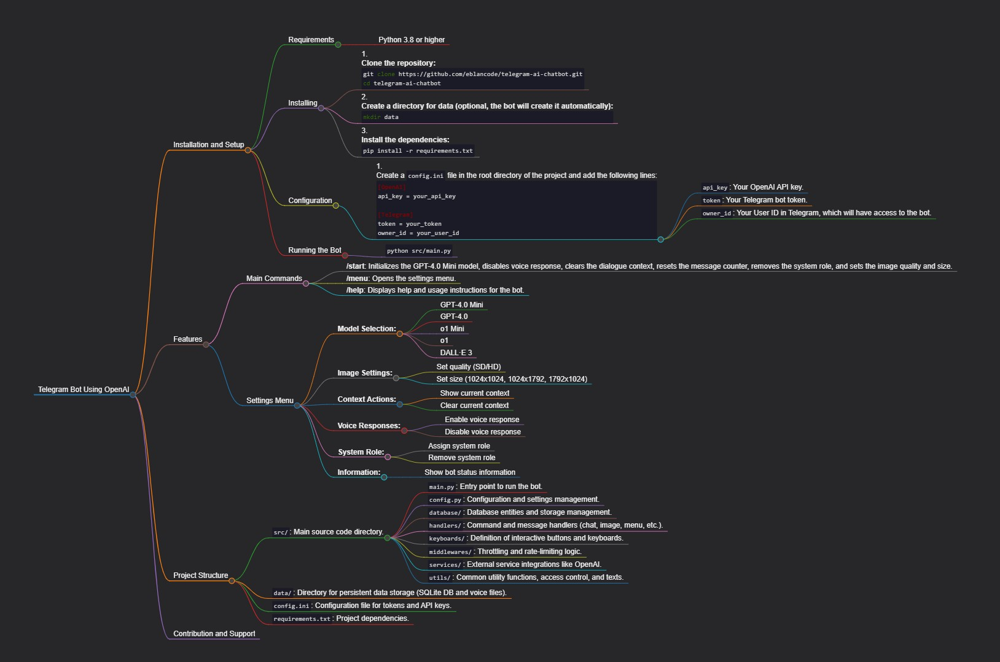

# Telegram AI Chatbot 🤖

[](https://www.python.org/downloads/)
[](https://opensource.org/licenses/MIT)
[](https://github.com/eblancode/telegram-ai-chatbot/stargazers)
[](https://github.com/eblancode/telegram-ai-chatbot/network/members)

A powerful Telegram bot built with **aiogram** that integrates **OpenAI's API** (GPT-4o, o1, DALL·E 3) for advanced text, image generation, and voice processing. Supports interactive menus, context management, and customizable settings—all in a clean, modular structure.




## 🚀 Quick Start

1. Clone the repo:

   ```bash
   git clone https://github.com/eblancode/telegram-ai-chatbot.git
   cd telegram-ai-chatbot
   ```

2. (Optional) Create data directory:

   ```bash
   mkdir data
   ```

3. Install dependencies:

   ```bash
   pip install -r requirements.txt
   ```

4. Create `config.ini` (see Configuration below).

5. Run:
   ```bash
   python src/main.py
   ```

## Features

### Core Commands

- `/start` — Reset and initialize (GPT-4o Mini default)
- `/menu` — Open interactive settings
- `/help` — Usage instructions

### Settings Menu

- **Models**: GPT-4o Mini, GPT-4o, o1 Mini, o1, DALL·E 3
- **Image Generation**: Quality (SD/HD), Sizes (1024x1024, etc.)
- **Context**: View/clear conversation history
- **Voice**: Enable/disable voice responses
- **System Role**: Custom prompts
- **Info**: Bot stats

### Tech Stack

- Python + aiogram
- OpenAI API (GPT + DALL·E)
- SQLite for persistence
- Voice message support

## Installation and Setup

### Requirements

- Python 3.8+

### Configuration

Create `config.ini` in root:

```ini
[OpenAI]
api_key = your_openai_api_key

[Telegram]
token = your_bot_token
owner_id = your_telegram_user_id
```

## Project Structure

- `src/` — Core code (handlers, services, etc.)
- `data/` — Persistent storage (DB + voice files)
- `config.ini` — Secrets
- `requirements.txt` — Dependencies

## 🤝 Contributing

We welcome contributions! Please see our [CONTRIBUTING.md](./CONTRIBUTING.md) for guidelines.

- Report bugs or request features via [Issues](https://github.com/eblancode/telegram-ai-chatbot/issues)
- Submit improvements via Pull Requests

## License

This project is licensed under the MIT License — see [LICENSE](LICENSE) for details.

---

Thanks for checking it out! ⭐ Star the repo if you find it useful.
